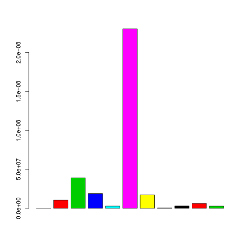
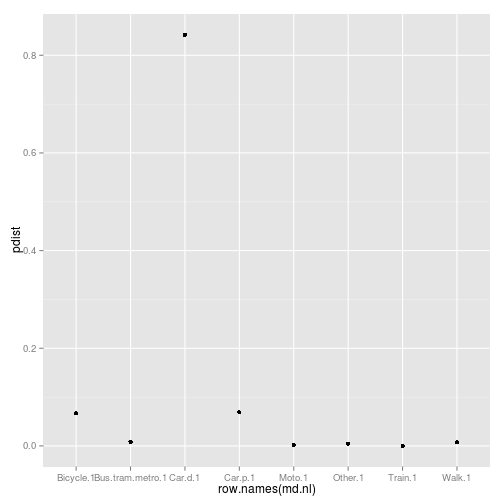
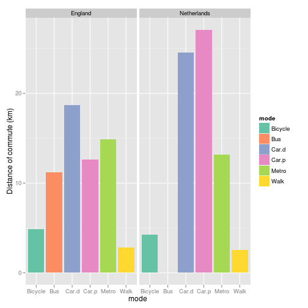

Comparison of energy costs of commuting in England and the Netherlands
========================================================

Before attempting to run these commands, you should have first downloaded and unzipped the 'energy-nat' folder onto your computer (download it [here](https://dl.dropboxusercontent.com/u/15008199/egs2stay/energy-nat.zip)) and have processed the [English](http://rpubs.com/RobinLovelace/7178) and [Dutch](http://rpubs.com/RobinLovelace/7180) commuting data examples. The resulting objects need to be on your R workspace when you run through this code, as it refers to data loaded from these sessions. 

Preliminary analysis of English energy costs
-----

```r
load("en-nl.RData")
gors$label <- gortex$V3  # set the zone codes to identify the English zones
```

```
## Loading required package: sp
```

```r
gors$ZONE_CODE <- gortex$V3  # again, for reference
gors$EAV <- gors$ET/gors$all.all  # average energy costs: total divided by the population
gors@data[, c(1:5, 115, 114, 116)]
```

```
##   ZONE_CODE               ZONE_LABEL all.all metro.all train.all        ET
## 0        NE               North East 1032968     22266      9119  34635581
## 1        NW               North West 2900020     15955     54356  95402871
## 2      YaTH Yorkshire and The Humber 2182839      7839     31830  74293853
## 3        EM            East Midlands 1917728      1287     18849  73848971
## 4        WM            West Midlands 2334567      4262     35408  81396375
## 5       EoE          East of England 2579378     21688    156054 106379285
## 6        Ln                   London 3319134    625224    404414  69060893
## 7        SE               South East 3888755      8949    218822 158129081
## 8        SW               South West 2286107      1916     21171  81036299
##   moden.other label
## 0           0    NE
## 1           0    NW
## 2           0  YaTH
## 3           0    EM
## 4           0    WM
## 5           0   EoE
## 6           0    Ln
## 7           0    SE
## 8           0    SW
```

```r
summary(gors$EAV)  # browsing out dataset
```

```
##    Min. 1st Qu.  Median    Mean 3rd Qu.    Max. 
##    20.8    33.5    34.9    34.7    38.5    41.2
```

```r
sum(gors$ET)/sum(gors$all.all)  # EN population-weighted average, lower than average of GORs
```

```
## [1] 34.5
```


Preliminary analysis of NL energy costs
-----

```r
r3$pops <- c(2415, 1180, 3530, 2583, 482, 642, 1968, 576, 1143, 1105, 356, 378)
sum(r3$pops)  # Adding populaitons of NL provinces to calculate per person averages
```

```
## [1] 16358
```

```r
summary(r3$etot)
```

```
##    Min. 1st Qu.  Median    Mean 3rd Qu.    Max. 
##    32.2    38.6    41.1    40.6    42.2    52.7
```

```r
sum(r3$Totaal.vervoerwijzen * r3$etot)/((mean(r3$Totaal.vervoerwijzen)) * 12)  # Netherlands region average (unweighted)
```

```
## [1] 40.72
```

```r
r3@data[, c("name", "code_hasc", "Vervoerwijzen", "Totaal.vervoerwijzen", "etot", 
    "pops")]  # re-check data
```

```
##             name code_hasc Vervoerwijzen Totaal.vervoerwijzen  etot pops
## 1  Noord-Brabant     NL.NB Noord-Brabant                 0.49 40.48 2415
## 2        Utrecht     NL.UT       Utrecht                 0.50 37.84 1180
## 3   Zuid-Holland     NL.ZH  Zuid-Holland                 0.47 32.21 3530
## 4  Noord-Holland     NL.NH Noord-Holland                 0.50 34.79 2583
## 5        Drenthe     NL.DR       Drenthe                 0.52 42.10  482
## 6      Friesland     NL.FR     Friesland                 0.47 42.42  642
## 7     Gelderland     NL.GE    Gelderland                 0.51 41.69 1968
## 8      Groningen     NL.GR     Groningen                 0.46 41.79  576
## 9        Limburg     NL.LI       Limburg                 0.48 38.89 1143
## 10    Overijssel     NL.OV    Overijssel                 0.51 40.19 1105
## 11     Flevoland     NL.FL     Flevoland                 0.52 52.67  356
## 12       Zeeland     NL.ZE       Zeeland                 0.47 42.73  378
```

```r
r3$etot * r3$pops
```

```
##  [1]  97749  44647 113716  89868  20290  27231  82046  24072  44450  44415
## [11]  18752  16151
```

```r
sum(gors$ET)/sum(gors$all.all)  # En pop weighted
```

```
## [1] 34.5
```

```r
sum(r3$etot * r3$pops)/sum(r3$pops)  # NL pop-weighted av. also lower, due to cities
```

```
## [1] 38.11
```

```r
38.1/34.5  # 10% difference...
```

```
## [1] 1.104
```

```r
(sum(gors$ET)/sum(gors$all.all))/(sum(r3$etot * r3$pops)/sum(r3$pops))
```

```
## [1] 0.9052
```

Comparing the modal split of commuter trips in England and the Netherlands
---------------------

```r
msplit.nl <- r3@data[, 7:14]
for (i in 1:8) {
    msplit.nl[, i] <- r3@data[, i + 6] * r3$pops
}
m.nl <- colSums(msplit.nl)
names(m.nl)[4] <- "Metro"

m.nl <- m.nl * 500
m.nl <- data.frame(tot = m.nl, prop = m.nl/sum(m.nl) * 100)
m.nl$mode <- row.names(m.nl)
m.nl <- m.nl[-c(3, 5, 8), ]
m.nl$Country <- "Netherlands"

head(gors@data)
```

```
##   ZONE_CODE               ZONE_LABEL all.all metro.all train.all bus.all
## 0        NE               North East 1032968     22266      9119  113224
## 1        NW               North West 2900020     15955     54356  248267
## 2      YaTH Yorkshire and The Humber 2182839      7839     31830  228839
## 3        EM            East Midlands 1917728      1287     18849  133858
## 4        WM            West Midlands 2334567      4262     35408  204347
## 5       EoE          East of England 2579378     21688    156054  102838
##   moto.all car.all carp.all taxi.all bike.all walk.all other.all  all.0
## 0     6967  570214    94389     7113    16786   105271      8311 203866
## 1    26731 1694380   217559    23400    65961   297720     13217 613763
## 2    20865 1226371   159789    11624    63384   238491      9626 451932
## 3    20018 1157931   133260     7926    62644   201247      7400 409400
## 4    20844 1400069   167936    10240    52545   222347      7746 469182
## 5    28637 1518613   150642    11693   100193   233737     11798 517466
##   metro.0 train.0 bus.0 moto.0  car.0 carp.0 taxi.0 bike.0 walk.0 other.0
## 0    1262     290 18335    777  74720  17162   2263   5997  82115     945
## 1     645    1472 35746   3550 251492  47740   8386  25902 236241    2589
## 2     558     893 27700   2735 169493  30703   3695  27401 186529    2225
## 3      27     463 16994   2646 166752  27968   2574  28918 161307    1751
## 4     194     969 27080   2890 198110  35468   2858  22379 177361    1873
## 5     295    2423 14177   3825 217932  31620   3127  51009 190497    2561
##    all.2 metro.2 train.2  bus.2 moto.2  car.2 carp.2 taxi.2 bike.2 walk.2
## 0 226278    5448     651  45659   1881 123674  28721   2577   6446  10740
## 1 654798    3258    4643 105994   7971 395005  72322   7780  24555  31942
## 2 496207    2652    1569  96720   6491 282753  51362   4221  23413  26056
## 3 390775      56     568  55778   5604 242977  41119   2875  21505  19445
## 4 524963     648    2039  84970   6040 327234  55768   3792  19573  23913
## 5 437395     375    2845  41326   6946 284912  42480   3150  32933  21399
##   other.2  all.5 metro.5 train.5 bus.5 moto.5  car.5 carp.5 taxi.5 bike.5
## 0     481 213822    8169     973 30061   2082 140657  23623    860   2617
## 1    1328 565533    5870   12094 70809   7430 397622  47143   2629   9521
## 2     970 425312    2667    3741 66368   5973 291890  36384   1563   7305
## 3     848 337671      62    1290 38214   5455 249655  28336    955   6983
## 4     986 449380    1035    6626 62047   5587 321791  36226   1487   6195
## 5    1029 354182     558    5243 21966   5688 278093  27082    997   8043
##   walk.5 other.5 all.10 metro.10 train.10 bus.10 moto.10 car.10 carp.10
## 0   4336     444 171898     5934     2430  13203    1529 130423   14224
## 1  11395    1020 416059     4215    18164  22992    5020 329283   26077
## 2   8709     712 308919      875    10122  25377    3628 239106   20426
## 3   6122     599 279593      253     3443  13888    3863 233038   17423
## 4   7642     744 330188     1138     9932  19604    3849 268705   19556
## 5   5851     661 379857     5595    10362  12773    5257 314866   21326
##   taxi.10 bike.10 walk.10 other.10 all.20 metro.20 train.20 bus.20 moto.20
## 0     349     912    2528      366  43847      209      874   1886     289
## 1     993    3099    5486      730 134197      375     6722   3353    1279
## 2     587    2254    5994      550  97625       81     5844   3822     834
## 3     402    2308    4488      487 108726       53     2744   3180    1044
## 4     553    1994    4303      554 123409      271     6253   3214    1132
## 5     638    3423    4840      777 201209     8198    24218   4809    2827
##   car.20 carp.20 taxi.20 bike.20 walk.20 other.20 all.30 metro.30 train.30
## 0  36558    3011      87     133     690      110  15191       60      275
## 1 113043    6804     233     571    1494      323  55566       87     2787
## 2  78927    5703     124     576    1517      197  43290       40     2760
## 3  93250    5506     128     679    1927      215  43203       15     1269
## 4 103689    6186     146     569    1704      245  45058       27     2517
## 5 148596    8543     284    1153    2182      399 107616     2903    30318
##   bus.30 moto.30 car.30 carp.30 taxi.30 bike.30 walk.30 other.30 all.40
## 0    501      83  12908     964      28      63     265       44  12328
## 1   1175     375  47145    2633      94     213     928      129  44734
## 2   1227     290  35170    2418      54     384     838      109  35478
## 3    855     364  37408    1967      68     281     886       90  35511
## 4    652     317  38530    2024      42     179     670      100  33450
## 5   1992    1439  65387    3679     117     504    1029      248 108875
##   metro.40 train.40 bus.40 moto.40 car.40 carp.40 taxi.40 bike.40 walk.40
## 0       75      371    469      54  10015     942      20      44     241
## 1       90     2585   1325     241  37013    2079      66     187     965
## 2       49     1997   1258     185  28600    1978      43     278     951
## 3       14     1328    803     248  30351    1547      45     274     767
## 4       28     1932    562     223  28392    1495      47     117     540
## 5     1308    46724   2095    1104  52868    2826      93     482    1091
##   other.40 all.60 metro.60 train.60 bus.60 moto.60 car.60 carp.60 taxi.60
## 0       97  29571      582     2190   1595     137  18073    2033     112
## 1      183  61724      786     3841   2838     343  42584    3064     264
## 2      139  56350      625     3358   3027     335  39047    3163     212
## 3      134  61249      620     6705   2207     409  43348    2717     102
## 4      114  56449      685     3860   2769     320  41135    2635     142
## 5      284  90977     1133    27617   1870     670  50983    2739     175
##   bike.60 walk.60 other.60 abbed    mfh moden.all moden.metro moden.train
## 0     260    2420     2169    NE  79308         0      175640      342044
## 1     763    4738     2503    NW 242474         0      146915     1286024
## 2     778    4284     1521  YaTH 184181         0       70707      956464
## 3     746    3501      894    EM 173308         0       36823      990636
## 4     611    3415      877    WM 208823         0       63421     1032208
## 5     951    3440     1399   EoE 243485         0      298160     7771360
##   moden.bus moden.moto moden.car moden.carp moden.taxi moden.bike
## 0   2635479     134196  31200791          0      98861       8081
## 1   5469084     498587  87555150          0     307831      30385
## 2   5415379     374630  67189678          0     168455      26777
## 3   3355704     383665  68868720          0     111118      25895
## 4   4631191     391319  75019779          0     152437      22530
## 5   3134069     646855  94272899          0     132046      38230
##   moden.walk moden.other        ET label   EAV
## 0      40489           0  34635581    NE 33.53
## 1     108896           0  95402871    NW 32.90
## 2      91762           0  74293853  YaTH 34.04
## 3      76410           0  73848971    EM 38.51
## 4      83491           0  81396375    WM 34.87
## 5      85665           0 106379285   EoE 41.24
```

```r
m.en <- colSums(gors@data[, c(5, 6, 8, 9, 11, 12, 4)])/sum(gors$all.all)
m.en <- colSums(gors@data[, c(4:13)])
m.en <- data.frame(tot = m.en, prop = m.en/sum(m.en) * 100)
wones <- c(4, 6, 8, 9, 11, 12) - 3
m.en <- m.en[wones, ]
m.en$mode <- c("Metro", "Bus", "Car.d", "Car.p", "Bicycle", "Walk")
m.en$Country <- "England"

m.all <- rbind(m.en, m.nl)
head(m.all)
```

```
##                tot   prop    mode Country
## metro.all   709386  3.480   Metro England
## bus.all    1685361  8.267     Bus England
## car.all   12324166 60.453   Car.d England
## carp.all   1370685  6.724   Car.p England
## bike.all    634588  3.113 Bicycle England
## walk.all   2241901 10.997    Walk England
```

```r
p <- ggplot(m.all, aes(y = prop, fill = mode))
p + geom_bar(aes(x = mode), stat = "identity") + facet_grid(facets = . ~ Country) + 
    scale_fill_brewer(type = "qual", palette = 7) + ylab("% of commuter trips")
```

 


Comparing distances
-----------

```r
names(gors)[4:15]
```

```
##  [1] "metro.all" "train.all" "bus.all"   "moto.all"  "car.all"  
##  [6] "carp.all"  "taxi.all"  "bike.all"  "walk.all"  "other.all"
## [11] "all.0"     "metro.0"
```

```r
md
```

```
##        X X0    V1    V2    V3    V4    V5    V6    V7    V8
## 1      1  0 0.000 0.000  0.00  0.00  0.00  0.00  0.00   0.0
## 2  metro  0 2.333 5.555 11.35 20.51 36.12  0.00  0.00  91.0
## 3  train  0 2.100 5.833 11.28 21.15 36.98 52.68 74.45 138.4
## 4    bus  0 2.450 5.310 10.84 19.48 38.73 56.00 78.40 154.7
## 5   moto  0 2.000 5.717  9.80 21.28 32.90 50.40  0.00   0.0
## 6   card  0 2.176 5.451 11.00 21.00 36.40 50.07 70.38 143.6
## 7   carp  0 2.155 5.492 11.09 21.30 37.14 51.00 67.20 133.0
## 8   taxi  0 2.400 4.200 12.60 16.80  0.00  0.00  0.00   0.0
## 9  cycle  0 2.063 5.458 10.53 16.10  0.00  0.00  0.00   0.0
## 10  walk  0 1.679 4.885 11.20 19.13 35.00  0.00  0.00   0.0
## 11 other  0 1.400 5.950 10.60 18.90 38.85 52.50 58.80 182.0
```

```r
md <- md[, -1]
t.en <- colSums(gors@data[, 3:101])
md
```

```
##    X0    V1    V2    V3    V4    V5    V6    V7    V8
## 1   0 0.000 0.000  0.00  0.00  0.00  0.00  0.00   0.0
## 2   0 2.333 5.555 11.35 20.51 36.12  0.00  0.00  91.0
## 3   0 2.100 5.833 11.28 21.15 36.98 52.68 74.45 138.4
## 4   0 2.450 5.310 10.84 19.48 38.73 56.00 78.40 154.7
## 5   0 2.000 5.717  9.80 21.28 32.90 50.40  0.00   0.0
## 6   0 2.176 5.451 11.00 21.00 36.40 50.07 70.38 143.6
## 7   0 2.155 5.492 11.09 21.30 37.14 51.00 67.20 133.0
## 8   0 2.400 4.200 12.60 16.80  0.00  0.00  0.00   0.0
## 9   0 2.063 5.458 10.53 16.10  0.00  0.00  0.00   0.0
## 10  0 1.679 4.885 11.20 19.13 35.00  0.00  0.00   0.0
## 11  0 1.400 5.950 10.60 18.90 38.85 52.50 58.80 182.0
```

```r
md$mdtotald <- 0
for (i in 1:11) {
    md[i, "mdtotald"] <- sum(md[i, 1:9] * colSums(gors@data[, seq(from = 4, 
        by = 11, length.out = 9) + i - 2]))
}
md
```

```
##    X0    V1    V2    V3    V4    V5    V6    V7    V8  mdtotald
## 1   0 0.000 0.000  0.00  0.00  0.00  0.00  0.00   0.0         0
## 2   0 2.333 5.555 11.35 20.51 36.12  0.00  0.00  91.0  10571205
## 3   0 2.100 5.833 11.28 21.15 36.98 52.68 74.45 138.4  39191501
## 4   0 2.450 5.310 10.84 19.48 38.73 56.00 78.40 154.7  18905134
## 5   0 2.000 5.717  9.80 21.28 32.90 50.40  0.00   0.0   2947787
## 6   0 2.176 5.451 11.00 21.00 36.40 50.07 70.38 143.6 230221407
## 7   0 2.155 5.492 11.09 21.30 37.14 51.00 67.20 133.0  17313725
## 8   0 2.400 4.200 12.60 16.80  0.00  0.00  0.00   0.0    501664
## 9   0 2.063 5.458 10.53 16.10  0.00  0.00  0.00   0.0   3082122
## 10  0 1.679 4.885 11.20 19.13 35.00  0.00  0.00   0.0   6319569
## 11  0 1.400 5.950 10.60 18.90 38.85 52.50 58.80 182.0   2985675
```

```r

md$dist <- md$mdtotald/t.en[1:11]
md$pdist <- md$mdtotald/sum(md$mdtotald)
md
```

```
##    X0    V1    V2    V3    V4    V5    V6    V7    V8  mdtotald   dist
## 1   0 0.000 0.000  0.00  0.00  0.00  0.00  0.00   0.0         0  0.000
## 2   0 2.333 5.555 11.35 20.51 36.12  0.00  0.00  91.0  10571205 14.902
## 3   0 2.100 5.833 11.28 21.15 36.98 52.68 74.45 138.4  39191501 41.253
## 4   0 2.450 5.310 10.84 19.48 38.73 56.00 78.40 154.7  18905134 11.217
## 5   0 2.000 5.717  9.80 21.28 32.90 50.40  0.00   0.0   2947787 11.817
## 6   0 2.176 5.451 11.00 21.00 36.40 50.07 70.38 143.6 230221407 18.680
## 7   0 2.155 5.492 11.09 21.30 37.14 51.00 67.20 133.0  17313725 12.631
## 8   0 2.400 4.200 12.60 16.80  0.00  0.00  0.00   0.0    501664  4.306
## 9   0 2.063 5.458 10.53 16.10  0.00  0.00  0.00   0.0   3082122  4.857
## 10  0 1.679 4.885 11.20 19.13 35.00  0.00  0.00   0.0   6319569  2.819
## 11  0 1.400 5.950 10.60 18.90 38.85 52.50 58.80 182.0   2985675 28.652
##       pdist
## 1  0.000000
## 2  0.031837
## 3  0.118033
## 4  0.056936
## 5  0.008878
## 6  0.693355
## 7  0.052144
## 8  0.001511
## 9  0.009282
## 10 0.019033
## 11 0.008992
```

```r
barplot(md$mdtotald, col = 1:11)
```

 

```r
md$tdist <- md$mdtotald
md <- md[, -10]
md2 <- md[c(3, 4, 6, 7, 9, 10, 2), ]
md2
```

```
##    X0    V1    V2    V3    V4    V5    V6    V7    V8   dist    pdist
## 3   0 2.100 5.833 11.28 21.15 36.98 52.68 74.45 138.4 41.253 0.118033
## 4   0 2.450 5.310 10.84 19.48 38.73 56.00 78.40 154.7 11.217 0.056936
## 6   0 2.176 5.451 11.00 21.00 36.40 50.07 70.38 143.6 18.680 0.693355
## 7   0 2.155 5.492 11.09 21.30 37.14 51.00 67.20 133.0 12.631 0.052144
## 9   0 2.063 5.458 10.53 16.10  0.00  0.00  0.00   0.0  4.857 0.009282
## 10  0 1.679 4.885 11.20 19.13 35.00  0.00  0.00   0.0  2.819 0.019033
## 2   0 2.333 5.555 11.35 20.51 36.12  0.00  0.00  91.0 14.902 0.031837
##        tdist
## 3   39191501
## 4   18905134
## 6  230221407
## 7   17313725
## 9    3082122
## 10   6319569
## 2   10571205
```

```r
md2$Country <- "England"
sum(md$tdist)/sum(gors$all.all)  # Total distance by all modes: 10 km
```

```
## [1] 14.8
```

```r

# Distance NL
names(r3)
```

```
##  [1] "c2"                     "Shape_Leng"            
##  [3] "name"                   "code_hasc"             
##  [5] "Vervoerwijzen"          "Totaal.vervoerwijzen"  
##  [7] "Car.d"                  "Car.p"                 
##  [9] "Train"                  "Bus.tram.metro"        
## [11] "Moto"                   "Bicycle"               
## [13] "Walk"                   "Other"                 
## [15] "Totaal.vervoerwijzen.1" "Car.d.1"               
## [17] "Car.p.1"                "Train.1"               
## [19] "Bus.tram.metro.1"       "Moto.1"                
## [21] "Bicycle.1"              "Walk.1"                
## [23] "Other.1"                "Totaal.vervoerwijzen.2"
## [25] "Car.d.2"                "Car.p.2"               
## [27] "Train.2"                "Bus.tram.metro.2"      
## [29] "Moto.2"                 "Bicycle.2"             
## [31] "Walk.2"                 "Other.2"               
## [33] "etot"                   "id"                    
## [35] "pops"
```

```r
md.nl <- data.frame(dist = colSums(r3@data[, 16:23])/nrow(r3@data))
md.nl  # v. useful infor: compare w.
```

```
##                    dist
## Car.d.1          24.582
## Car.p.1          27.097
## Train.1          38.350
## Bus.tram.metro.1 13.207
## Moto.1            8.858
## Bicycle.1         4.265
## Walk.1            2.544
## Other.1          22.011
```

```r
md.nl$tdist <- md.nl[, 1] * colSums(r3@data[, 7:14])
md.nl$pdist <- md.nl$tdist/sum(md.nl$tdist)
md.nl$Country <- "Netherlands"
qplot(data = md.nl, x = row.names(md.nl), y = pdist)
```

 

```r
md.nl$ptrips <- colSums(r3@data[, 7:14])/nrow(r3@data)

sum(md.nl$dist * md.nl$ptrips)
```

```
## [1] 16.03
```

```r
md.nl
```

```
##                    dist    tdist    pdist     Country   ptrips
## Car.d.1          24.582 161.9107 0.841695 Netherlands 0.548887
## Car.p.1          27.097  13.2633 0.068950 Netherlands 0.040790
## Train.1          38.350   0.0000 0.000000 Netherlands 0.000000
## Bus.tram.metro.1 13.207   1.6355 0.008502 Netherlands 0.010319
## Moto.1            8.858   0.3656 0.001901 Netherlands 0.003440
## Bicycle.1         4.265  12.8688 0.066899 Netherlands 0.251442
## Walk.1            2.544   1.4011 0.007283 Netherlands 0.045891
## Other.1          22.011   0.9175 0.004770 Netherlands 0.003474
```

```r

md.all <- rbind(md2[, c("dist", "pdist", "tdist", "Country")], md.nl[-which(row.names(md.nl) == 
    "Moto.1" | row.names(md.nl) == "Other.1"), c("dist", "pdist", "tdist", "Country")])
md.all
```

```
##                    dist    pdist     tdist     Country
## 3                41.253 0.118033 3.919e+07     England
## 4                11.217 0.056936 1.891e+07     England
## 6                18.680 0.693355 2.302e+08     England
## 7                12.631 0.052144 1.731e+07     England
## 9                 4.857 0.009282 3.082e+06     England
## 10                2.819 0.019033 6.320e+06     England
## 2                14.902 0.031837 1.057e+07     England
## Car.d.1          24.582 0.841695 1.619e+02 Netherlands
## Car.p.1          27.097 0.068950 1.326e+01 Netherlands
## Train.1          38.350 0.000000 0.000e+00 Netherlands
## Bus.tram.metro.1 13.207 0.008502 1.635e+00 Netherlands
## Bicycle.1         4.265 0.066899 1.287e+01 Netherlands
## Walk.1            2.544 0.007283 1.401e+00 Netherlands
```

```r
md.all$mode = c("Train", "Bus", "Car.d", "Car.p", "Bicycle", "Walk", "Metro", 
    "Car.d", "Car.p", "Train", "Metro", "Bicycle", "Walk")
md.all
```

```
##                    dist    pdist     tdist     Country    mode
## 3                41.253 0.118033 3.919e+07     England   Train
## 4                11.217 0.056936 1.891e+07     England     Bus
## 6                18.680 0.693355 2.302e+08     England   Car.d
## 7                12.631 0.052144 1.731e+07     England   Car.p
## 9                 4.857 0.009282 3.082e+06     England Bicycle
## 10                2.819 0.019033 6.320e+06     England    Walk
## 2                14.902 0.031837 1.057e+07     England   Metro
## Car.d.1          24.582 0.841695 1.619e+02 Netherlands   Car.d
## Car.p.1          27.097 0.068950 1.326e+01 Netherlands   Car.p
## Train.1          38.350 0.000000 0.000e+00 Netherlands   Train
## Bus.tram.metro.1 13.207 0.008502 1.635e+00 Netherlands   Metro
## Bicycle.1         4.265 0.066899 1.287e+01 Netherlands Bicycle
## Walk.1            2.544 0.007283 1.401e+00 Netherlands    Walk
```

```r

qplot(data = md.all[-c(1, 10), ], x = mode, y = dist, fill = mode, geom = "bar") + 
    facet_grid(facets = . ~ Country) + scale_fill_brewer(type = "qual", palette = 7) + 
    ylab("Distance of commute (km)")
```

```
## Mapping a variable to y and also using stat="bin".  With stat="bin", it
## will attempt to set the y value to the count of cases in each group.  This
## can result in unexpected behavior and will not be allowed in a future
## version of ggplot2.  If you want y to represent counts of cases, use
## stat="bin" and don't map a variable to y.  If you want y to represent
## values in the data, use stat="identity".  See ?geom_bar for examples.
## (Deprecated; last used in version 0.9.2)
```

```
## Mapping a variable to y and also using stat="bin".  With stat="bin", it
## will attempt to set the y value to the count of cases in each group.  This
## can result in unexpected behavior and will not be allowed in a future
## version of ggplot2.  If you want y to represent counts of cases, use
## stat="bin" and don't map a variable to y.  If you want y to represent
## values in the data, use stat="identity".  See ?geom_bar for examples.
## (Deprecated; last used in version 0.9.2)
```

 

```r

md.all$ptrips <- 0
md.all$ptrips[8:13] <- colMeans(r3@data[, c(1, 2, 3, 4, 6, 7) + 6])
md.all$ptrips[1:7] <- colSums(gors@data[, c(5, 6, 8, 9, 11, 12, 4)])/sum(gors$all.all)
md.all
```

```
##                    dist    pdist     tdist     Country    mode  ptrips
## 3                41.253 0.118033 3.919e+07     England   Train 0.04233
## 4                11.217 0.056936 1.891e+07     England     Bus 0.07510
## 6                18.680 0.693355 2.302e+08     England   Car.d 0.54917
## 7                12.631 0.052144 1.731e+07     England   Car.p 0.06108
## 9                 4.857 0.009282 3.082e+06     England Bicycle 0.02828
## 10                2.819 0.019033 6.320e+06     England    Walk 0.09990
## 2                14.902 0.031837 1.057e+07     England   Metro 0.03161
## Car.d.1          24.582 0.841695 1.619e+02 Netherlands   Car.d 0.54889
## Car.p.1          27.097 0.068950 1.326e+01 Netherlands   Car.p 0.04079
## Train.1          38.350 0.000000 0.000e+00 Netherlands   Train 0.00000
## Bus.tram.metro.1 13.207 0.008502 1.635e+00 Netherlands   Metro 0.01032
## Bicycle.1         4.265 0.066899 1.287e+01 Netherlands Bicycle 0.25144
## Walk.1            2.544 0.007283 1.401e+00 Netherlands    Walk 0.04589
```


Basic analysis of average distances
--------

```r
sum(md.all$dist[1:7] * md.all$ptrips[1:7])  # 14.5 av dist uk
```

```
## [1] 14.51
```

```r
sum(md.all$dist[8:13] * md.all$ptrips[8:13])
```

```
## [1] 15.92
```

```r
md.all$dist[md.all$mode == "Car.d"][2]/md.all$dist[md.all$mode == "Car.d"][1]
```

```
## [1] 1.316
```


The relationship between energy use and population density
-------

```r
library(rgeos)
```

```
## rgeos version: 0.2-17, (SVN revision 392) GEOS runtime version:
## 3.3.8-CAPI-1.7.8 Polygon checking: TRUE
```

```r
gors$area <- gArea(gors, byid = T)/1e+06
r3$area <- gArea(r3, byid = T)/1e+06
r3$popdens <- r3$pops * 1000/r3$area
gors$popdens <- gors$all.all * 2/gors$area
r3$EAV <- r3$etot

pden.all <- rbind(r3@data[, c("popdens", "EAV")], gors@data[, c("popdens", "EAV")])
pden.all$Country <- c(rep("Netherlands", 12), rep("England", 9))
qplot(data = pden.all, x = popdens, y = EAV, color = Country) + ylab("Energy costs of commuting (MJ/trip)") + 
    xlab("Population density (ppl/sqkm)") + geom_abline(intercept = sum(gors$ET)/sum(gors$all.all), 
    slope = 0, colour = "red") + geom_abline(intercept = sum(r3$etot * r3$pops)/sum(r3$pops), 
    slope = 0, colour = "blue")
```

 


