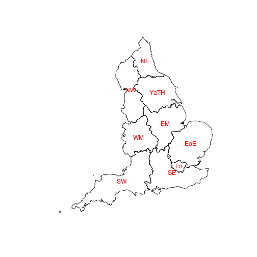
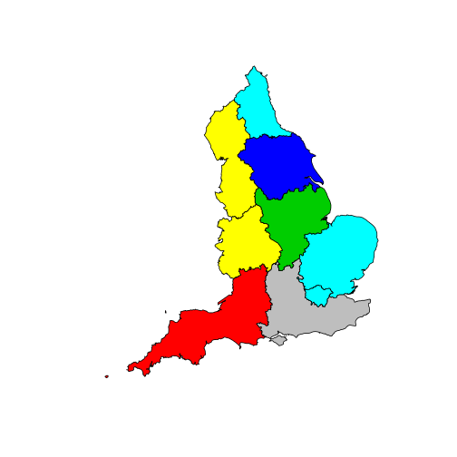
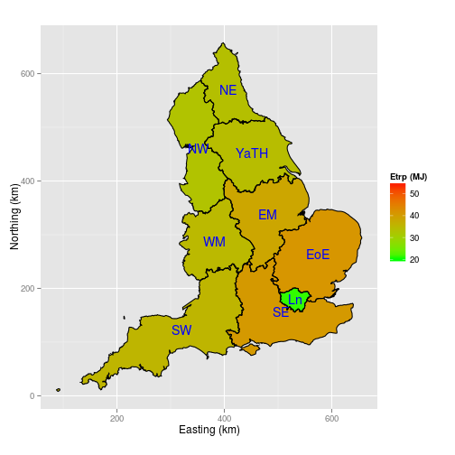

Loading and plotting English commuting data 
========================================================

This is document is based on "england.R", a script file that loads raw data on commuting in England, analyses it, and then plots it at the regional level. This is the first of three R script files for comparing the energy costs of commuting in the England and the Netherlands. (The other two can be found [here](http://rpubs.com/RobinLovelace/7182) and [here](http://rpubs.com/RobinLovelace/7180)). The input data and code is a available as a [.zip file](https://dl.dropboxusercontent.com/u/15008199/egs2stay/energy-nat.zip). The R packages we will be using to do the analysis include ggplot2 (for plotting), sp (for spatial data analysis) and rgeos for geographic functions. Load them in batch with the following two commands:


```r
x = c("ggplot2", "sp", "rgeos", "mapproj", "rgdal", "maptools")
lapply(x, require, character.only = T)  # the R packages we'll be using
```

```
## Loading required package: sp
```

```
## Loading required package: rgeos
```

```
## rgeos version: 0.2-17, (SVN revision 392) GEOS runtime version:
## 3.3.8-CAPI-1.7.8 Polygon checking: TRUE
```

```
## Loading required package: mapproj
```

```
## Loading required package: maps
```

```
## Loading required package: rgdal
```

```
## rgdal: version: 0.8-9, (SVN revision 470) Geospatial Data Abstraction
## Library extensions to R successfully loaded Loaded GDAL runtime: GDAL
## 1.10.0, released 2013/04/24 but rgdal build and GDAL runtime not in sync:
## ... consider re-installing rgdal!! Path to GDAL shared files:
## /usr/share/gdal/1.10 Loaded PROJ.4 runtime: Rel. 4.8.0, 6 March 2012,
## [PJ_VERSION: 480] Path to PROJ.4 shared files: (autodetected)
```

```
## Loading required package: maptools
```

```
## Loading required package: grid
```

```
## Loading required package: lattice
```

```
## Checking rgeos availability: TRUE
```

```
## [[1]]
## [1] TRUE
## 
## [[2]]
## [1] TRUE
## 
## [[3]]
## [1] TRUE
## 
## [[4]]
## [1] TRUE
## 
## [[5]]
## [1] TRUE
## 
## [[6]]
## [1] TRUE
```


As with most data analysis tasks, the first stage is to load and view the data.

Loading and viewing the English commuting data
-----------
Set R's working directory to the right place for the English data (the folder "EN-Data"). For this to work, R must already have "energy-nat" as its working directory. Rstudio users can do this by clicking 'Session > Set Working Directory > To Source file location'. The shapefile data is loaded using the command readOGR:


```r
setwd("EN-Data/")  # navigate to the correct working directory
gors <- readOGR(".", layer = "GOR_st121")  # load the data!
```

```
## OGR data source with driver: ESRI Shapefile 
## Source: ".", layer: "GOR_st121"
## with 9 features and 102 fields
## Feature type: wkbPolygon with 2 dimensions
```


Now that the English regions are loaded, it's time to naviagate back to the previous directory, take a look at the data we have loaded, abbreviate the region names, and plot the results to ensure they make sense:


```r
setwd("../")
getwd()  # check we're in the correct directory: energy-nat
```

```
## [1] "/home/robin/Dropbox/Thesis/Reproducible"
```

```r
class(gors)  # check we've got the right R object: SpatialPolygonsDataFrame
```

```
## [1] "SpatialPolygonsDataFrame"
## attr(,"package")
## [1] "sp"
```

```r
gors@data[, 1:5]  # take a look at the first 5 columns of data: integer counts
```

```
##   ZONE_CODE               ZONE_LABEL ST1210001 ST1210002 ST1210003
## 0         A               North East   1032968     79308     22266
## 1         B               North West   2900020    242474     15955
## 2         D Yorkshire and The Humber   2182839    184181      7839
## 3         E            East Midlands   1917728    173308      1287
## 4         F            West Midlands   2334567    208823      4262
## 5         G          East of England   2579378    243485     21688
## 6         H                   London   3319134    285935    625224
## 7         J               South East   3888755    386301      8949
## 8         K               South West   2286107    251408      1916
```

```r
gors$abbed <- abbreviate(gors$ZONE_LABEL, minlength = 2)  # create abbreviated area names
gors@data[1:5, c("ZONE_LABEL", "abbed")]  # check the abbreviation worked
```

```
##                 ZONE_LABEL abbed
## 0               North East    NE
## 1               North West    NW
## 2 Yorkshire and The Humber  YaTH
## 3            East Midlands    EM
## 4            West Midlands    WM
```

```r
plot(gors)  # results in a plot of England
text(coordinates(gors), labels = gors$abbed, col = "red")  # add our region names: in the right place?
```

 


Adding distances and calculating energy costs for modes
---------------
Now we need to make sense of the 103 columns of data that constitute the regional data ("gors@data"). At the moment the columns have names such as ST121001. We need to rename them so they make sense as commuting modes and distance bands:

```r
dbreaks <- c(2, 5, 10, 20, 30, 40, 60)  # these are the distance breaks in the data
dbreaks2 <- c("all", 0, dbreaks)  # correct labels to use with our data
# other than 002 it's an 11 by 9 matrix
modenames <- c("all", "metro", "train", "bus", "moto", "car", "carp", "taxi", 
    "bike", "walk", "other")
newnames <- paste(rep(modenames, times = 9), rep(dbreaks2, each = 11), sep = ".")  # give each column a unique name
newnames[1:20]  # Shows the logical structure of the column names created with the above command
```

```
##  [1] "all.all"   "metro.all" "train.all" "bus.all"   "moto.all" 
##  [6] "car.all"   "carp.all"  "taxi.all"  "bike.all"  "walk.all" 
## [11] "other.all" "all.0"     "metro.0"   "train.0"   "bus.0"    
## [16] "moto.0"    "car.0"     "carp.0"    "taxi.0"    "bike.0"
```

```r
gors@data$mfh <- gors@data$ST1210002  # rename the column that does not fit: mainly from home (mfh)
gors@data <- gors@data[, -4]  # remove the original mainly working from home column: gets in the way
names(gors@data)[3:101] <- newnames
ecosts <- c(0, 0.57, 0.77, 2.1, 1.7, 3, 0, 3, 0.09, 0.13, 0)  # these are the direct energy costs (MJ/KM) for each mode
names(ecosts) <- c("All", "Tram", "Train", "Bus", "Moto", "Car.d", "Car.p", 
    "Taxi", "Cycle", "Walk", "Other")
barplot(ecosts[2:9])  # Make sense?
```

 

The data we now have is counts of people travelling by certain modes in specific distance boundaries. The problem is that these distance bins apply for Euclidean (straight line) distance. To calculate energy costs, we need to know the average route distance. To solve this problem, an external dataset (Understanding Society) was used to identify the most common route distances within each category; the average [circuity](http://en.wikibooks.org/wiki/Transportation_Geography_and_Network_Science/Circuity) factor is assumed to be 1.4 ([Ballou, 2002](http://www.sciencedirect.com/science/article/pii/S0965856401000441)). This stage introduces much uncertainty: we cannot be sure that the route distance for each distance boundary are as illustrated below, and more research is clearly needed in this area.

```r
md <- read.csv("dbxs.csv", header = T, )  # the distances associated with each distance bin
plot(rep(c(0, 0, 1, 3.5, 7.5, 15, 25, 35, 50, 100), 11), t(md))  # visualise them: make sense?
```

```
## Warning: NAs introduced by coercion
```

 

With estimates of route distances for different modes now saved, we can progress to calculate the energy costs of each distance/mode category.


```r
mdv <- as.vector(as.matrix(md[, 2:10]))  # rearange the distances data
edcosts <- rep(ecosts, 9) * mdv  # multiply the energy costs by average distances fo each of 9 modes
ecs <- sweep(x = gors@data[, 3:101], MARGIN = 2, edcosts, "*")  # multiply the count data in each cell by their respective energy cost, for every zone
(ecs)[seq(6, by = 11, length.out = 9)]  # test for one mode: cars (for all zones)
```

```
##   car.all   car.0   car.2    car.5   car.10   car.20   car.30   car.40
## 0       0  487809 2022592  4640271  8217492  3992134  1938966  2114500
## 1       0 1641865 6459999 13117540 20746957 12344296  7081853  7814678
## 2       0 1106535 4624205  9629444 15065223  8618828  5283036  6038413
## 3       0 1088640 3973699  8236112 14682900 10182900  5619216  6408108
## 4       0 1293361 5351657 10615877 16930151 11322839  5787756  5994498
## 5       0 1422768 4659514  9174281 19838593 16226683  9822062 11162197
## 6       0  914904 4418109  9703407 13184354  5621725  3361796  3491512
## 7       0 2128173 7288078 15150217 28018217 22047808 14436344 18288792
## 8       0 1466438 4634721  9009925 16004838  9229693  5971318  7294657
##     car.60
## 0  7787027
## 1 18347964
## 2 16823994
## 3 18677145
## 4 17723641
## 5 21966801
## 6  8345859
## 7 33965105
## 8 22581215
```

```r
ecs.mode <- cbind(rowSums(ecs[, seq(2, by = 11, length.out = 9)]))
ecs.mode <- data.frame(array(dim = c(9, 11)))
for (i in 1:11) {
    ecs.mode[, i] <- cbind(rowSums(ecs[, seq(from = i, by = 11, length.out = 9)]))
}
paste(names(ecs), "en", sep = ".")
```

```
##  [1] "all.all.en"   "metro.all.en" "train.all.en" "bus.all.en"  
##  [5] "moto.all.en"  "car.all.en"   "carp.all.en"  "taxi.all.en" 
##  [9] "bike.all.en"  "walk.all.en"  "other.all.en" "all.0.en"    
## [13] "metro.0.en"   "train.0.en"   "bus.0.en"     "moto.0.en"   
## [17] "car.0.en"     "carp.0.en"    "taxi.0.en"    "bike.0.en"   
## [21] "walk.0.en"    "other.0.en"   "all.2.en"     "metro.2.en"  
## [25] "train.2.en"   "bus.2.en"     "moto.2.en"    "car.2.en"    
## [29] "carp.2.en"    "taxi.2.en"    "bike.2.en"    "walk.2.en"   
## [33] "other.2.en"   "all.5.en"     "metro.5.en"   "train.5.en"  
## [37] "bus.5.en"     "moto.5.en"    "car.5.en"     "carp.5.en"   
## [41] "taxi.5.en"    "bike.5.en"    "walk.5.en"    "other.5.en"  
## [45] "all.10.en"    "metro.10.en"  "train.10.en"  "bus.10.en"   
## [49] "moto.10.en"   "car.10.en"    "carp.10.en"   "taxi.10.en"  
## [53] "bike.10.en"   "walk.10.en"   "other.10.en"  "all.20.en"   
## [57] "metro.20.en"  "train.20.en"  "bus.20.en"    "moto.20.en"  
## [61] "car.20.en"    "carp.20.en"   "taxi.20.en"   "bike.20.en"  
## [65] "walk.20.en"   "other.20.en"  "all.30.en"    "metro.30.en" 
## [69] "train.30.en"  "bus.30.en"    "moto.30.en"   "car.30.en"   
## [73] "carp.30.en"   "taxi.30.en"   "bike.30.en"   "walk.30.en"  
## [77] "other.30.en"  "all.40.en"    "metro.40.en"  "train.40.en" 
## [81] "bus.40.en"    "moto.40.en"   "car.40.en"    "carp.40.en"  
## [85] "taxi.40.en"   "bike.40.en"   "walk.40.en"   "other.40.en" 
## [89] "all.60.en"    "metro.60.en"  "train.60.en"  "bus.60.en"   
## [93] "moto.60.en"   "car.60.en"    "carp.60.en"   "taxi.60.en"  
## [97] "bike.60.en"   "walk.60.en"   "other.60.en"
```

```r
names(ecs.mode) <- paste("moden", modenames, sep = ".")
gors@data <- cbind(gors@data, ecs.mode)
gors@data$ET <- rowSums(ecs)
plot(gors, col = rowSums(ecs))
```

 


Save the results and prepare for plotting
-------------------


```r
# writeOGR(obj=gors, dsn='.', layer='gorens', driver='ESRI Shapefile') #
# uncomment to save convert to ggplot2, just for plotting
fgor <- fortify(gors, region = "ZONE_LABEL")
fgor <- merge(fgor, gors@data[, c(1, 2, 3, 8, ncol(gors@data))], by.x = "id", 
    by.y = "ZONE_LABEL")
head(fgor)
```

```
##              id   long    lat order  hole piece           group ZONE_CODE
## 1 East Midlands 512596 414420     1 FALSE     1 East Midlands.1         E
## 2 East Midlands 512679 414233     2 FALSE     1 East Midlands.1         E
## 3 East Midlands 512930 414299     3 FALSE     1 East Midlands.1         E
## 4 East Midlands 513070 414351     4 FALSE     1 East Midlands.1         E
## 5 East Midlands 513202 414031     5 FALSE     1 East Midlands.1         E
## 6 East Midlands 513427 414170     6 FALSE     1 East Midlands.1         E
##   all.all car.all       ET
## 1 1917728 1157931 73848971
## 2 1917728 1157931 73848971
## 3 1917728 1157931 73848971
## 4 1917728 1157931 73848971
## 5 1917728 1157931 73848971
## 6 1917728 1157931 73848971
```

```r
gortex <- coordinates(gors)/1000
gortex <- as.data.frame(cbind(gortex))
gortex$V3 <- gors$abbed
head(gortex)
```

```
##      V1    V2   V3
## 0 406.5 569.5   NE
## 1 351.9 461.3   NW
## 2 451.3 452.1 YaTH
## 3 481.0 337.2   EM
## 4 381.7 286.8   WM
## 5 573.8 263.7  EoE
```

```r
class(gortex$V1)
```

```
## [1] "numeric"
```


Plotting the final results
----------
Finally, we use ggplot2 as a static GIS, to plot the results in a certain way (to be comparable with the Nethelands data):

```r
p <- ggplot(data = fgor, aes(x = long/1000, y = lat/1000))
p + geom_polygon(data = fgor, aes(x = long/1000, y = lat/1000, fill = ET/all.all, 
    group = group)) + geom_path(data = fgor, aes(x = long/1000, y = lat/1000, 
    group = group)) + scale_fill_continuous(low = "green", high = "red", name = "Etrp (MJ)", 
    limits = c(20, 55)) + coord_fixed() + xlab("Easting (km)") + ylab("Northing (km)") + 
    geom_text(data = gortex, aes(x = V1, y = V2, label = V3), colour = "blue")  #+ theme_minimal()
```

 


